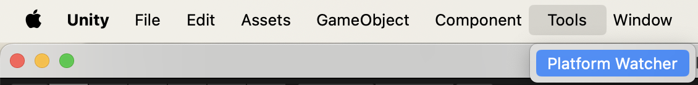
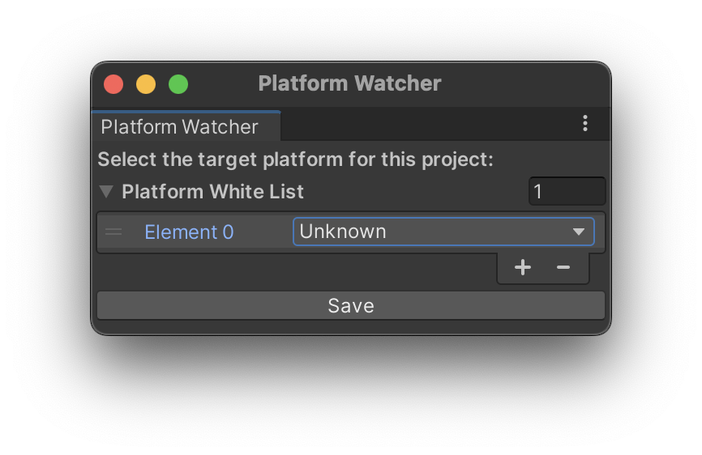
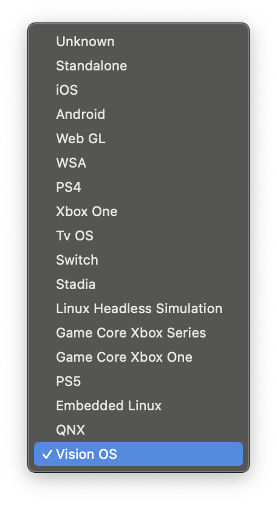
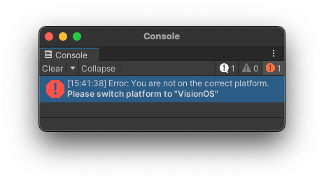
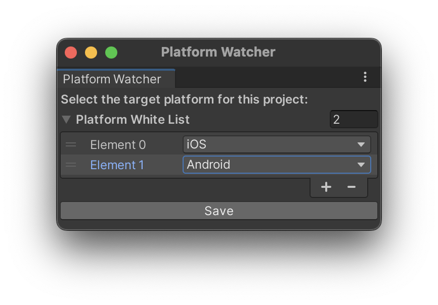

# Platform Watcher

[](https://openupm.com/packages/com.segur.platform-watcher/)
[](https://openupm.com/packages/com.segur.platform-watcher/)


# What is this tool?

This tool displays an error if the Unity platform is not the specified one.

For example, have you ever been working with several people on a Unity project for WebGL application development, and one of the members of the team did not switch the Platform to WebGL, and you encountered a mysterious build error and spent a lot of time troubleshooting?

With this tool, if you forgot to Switch Platform, the error will be displayed and you will notice it immediately!

Please give it a try!


# Requirements

Unity 2019.4 or later


# Install via OpenUPM command-line interface

```bash
# Install openupm-cli
npm install -g openupm-cli

# Go to your unity project directory
cd YOUR_UNITY_PROJECT_DIR

# Install package:
openupm add com.segur.platform-watcher
```


# How to use

## 1. Open the Platform Watcher
Navigate to  `Tools > Platform Watcher`.



## 2. Access the Platform Watcher Window

The Platform Watcher window will appear.



## 3. Select Your Desired Platform

Click `Unknown` and choose the platform you want.



For example, you can select `Vision OS` as shown below:


## 4. Check for Platform Mismatch

- If the active platform **IS** `Vision OS`, no error message will be displayed.
- If the active platform **IS NOT** `Vision OS`, an error message will appear.




# Multi-Platform Support
You can select multiple platforms.

For example, iOS and Android can be selected as shown below:




# Setting File

The information about which Platform is selected is stored in the file `PlatformWatcherSetting`.json under the `ProjectSettings` folder.


If you share this file via Git or other means, you can share the settings even if multiple people are developing a Unity project!
